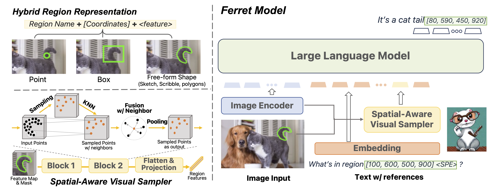

<!-- # Project Name

This software project accompanies the research paper, [Paper title](https://arxiv.org).

Brief description of the project.

## Documentation

## Getting Started  -->

#  Ferret: Refer and Ground Anything Anywhere at Any Granularity

An end-to-end MLLM that can accept any-form referring and ground anything in response.*

[Haoxuan You*](https://hxyou.github.io/), [Haotian Zhang*](https://haotian-zhang.github.io/), [Zhe Gan](https://zhegan27.github.io/), [Xianzhi Du](https://scholar.google.com/citations?user=l1hP40AAAAAJ&hl=en), [Bowen Zhang](https://zbwglory.github.io/), [Zirui Wang](https://www.cs.cmu.edu/~ziruiw/), [Liangliang Cao](http://llcao.net/), [Shih-Fu Chang](https://www.ee.columbia.edu/~sfchang/), [Yinfei Yang](https://sites.google.com/site/yinfeiyang/) 
[*: equal contribution]

## Overview

    </a>  
    Diagram of Ferret Model.

Key Contributions:
* Ferret Model - **Hybrid Region Representation + Spatial-aware Visual Sampler** enable fine-grained and open-vocabulary referring and grounding in MLLM.
* GRIT Dataset (~1.1M) - A **Large-scale, Hierarchical, Robust** ground-and-refer instruction tuning dataset.
* Ferret-Bench - A multimodal evaluation benchmark that jointly requires **Referring/Grounding, Semantics, Knowledge, and Reasoning**.