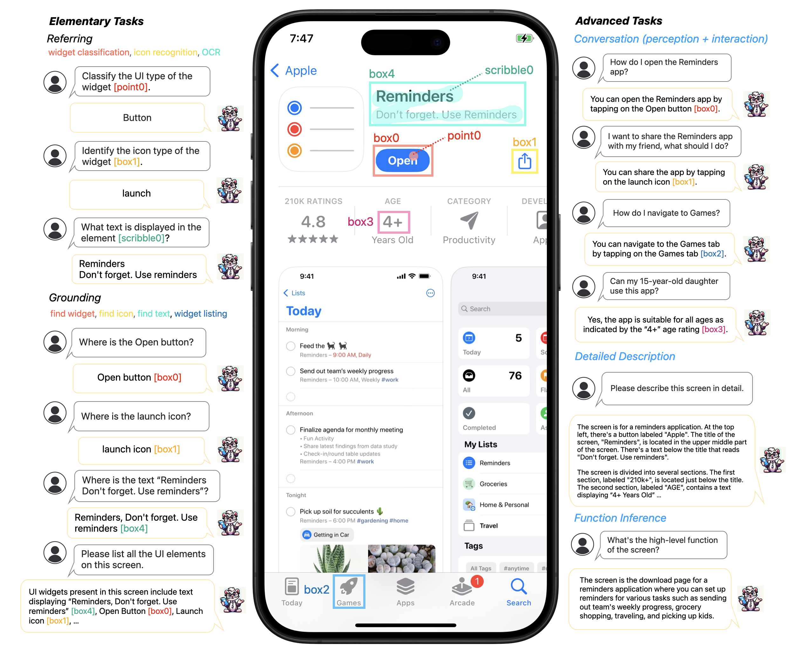
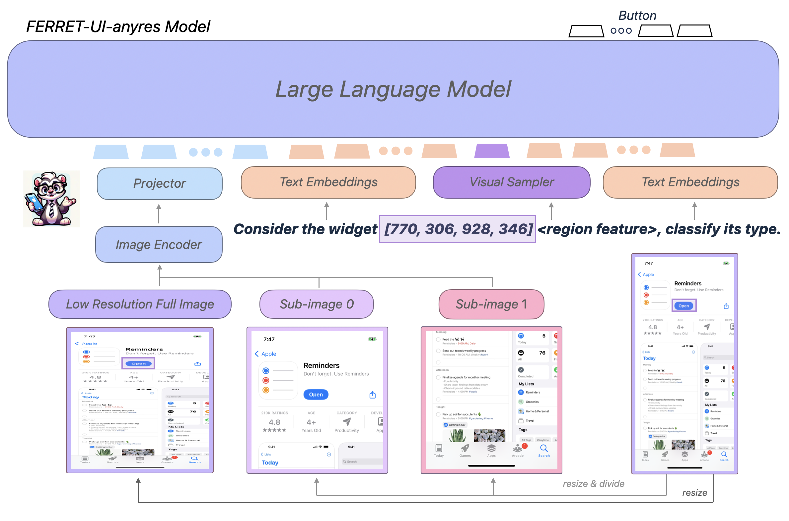

#  Ferret-UI: Grounded Mobile UI Understanding with Multimodal LLMs 
*A new MLLM tailored for enhanced understanding of mobile UI screens, equipped with referring, grounding, and reasoning capabilities.* [[Paper](https://arxiv.org/pdf/2404.05719)]

[Keen You](http://keenyyou.github.io/), [Haotian Zhang](https://scholar.google.com/citations?user=1vz0kKUAAAAJ&hl=en/), [Eldon Schoop](https://eldon.io), [Floris Weers](https://weers.dev/), [Amanda Swearngin](https://amaswea.github.io/), [Jeffrey Nichols](https://www.jeffreynichols.com/), [Yinfei Yang](https://sites.google.com/site/yinfeiyang/), [Zhe Gan](https://zhegan27.github.io/)

## Overview
<p align="center">
  
</p> 

Key contributions: 
- We introduce **Ferret-UI**, the first UI-centric MLLM that is capable of effectively executing **referring, grounding, and reasoning** tasks.
- We define a set of elementary and advanced UI tasks, for which we have meticulously gathered training samples for model training.
- We develop a comprehensive test benchmark encompassing all the tasks under investigation.
- We release **two Ferret-UI checkpoints**, built on gemma-2b and Llama-3-8B models respectively, for public exploration.

## Model Architecture

<p align="center">
  
</p> 

While Ferret-UI-base closely follows Ferret’s architecture, Ferret-UI-anyres incorporates additional fine-grained image features. Particularly, a pre-trained image encoder and projection layer produce image features for the entire screen. For each sub-image obtained based on the original image aspect ratio, additional image features are generated. For text with regional references, a visual sampler generates a corresponding regional continuous feature. The LLM uses the full-image representation, sub-image representations, regional features, and text embeddings to generate a response.


## Release
- [10/08/2024] 🔥 We release two Ferret-UI checkpoints trained with any-resolution schema: **FerretUI-Gemma2b, FerretUI-Llama8B**.
- [07/03/2024] 🔥 Ferret-UI is accepted to ECCV 2024. 

**Usage and License Notices**: The data and code is intended and licensed for research use only. They are also restricted to uses that follow the license agreement of Gemma and LLaMA. The dataset is CC BY NC 4.0 (allowing only non-commercial use) and models trained using the dataset should not be used outside of research purposes. 

## Model Checkpoints & Performance

Model checkpoints can be found at [Ferret-UI-gemma2b](https://ml-site.cdn-apple.com/models/ferretui/gemma2b-anyres.zip) and [Ferret-UI-Llama8B](https://ml-site.cdn-apple.com/models/ferretui/llama8b-anyres.zip).

| Model               | Ref-i | Ref-A | Grd-i | Grd-A |
|:--------------------|:-----:|:-----:|:-----:|:-----:|
| _Ferret-UI-Gemma2b_ | 82.75 | 80.80 | 72.21 | 73.20 |
| _Ferret-UI-Llama8b_ | 87.04 | 85.18 | 78.63 | 76.58 |

Both model are trained using the data collection described in the paper, using a learning rate of 2e-5 for 3 epochs with a global batch size of 128.

## Install

1. Clone this repository and navigate to `ferretui` folder
```bash
git clone https://github.com/apple/ml-ferret
cd ferretui
```

2. Install Package
```Shell
conda create -n ferret python=3.10 -y
conda activate ferret
pip install --upgrade pip  # enable PEP 660 support
pip install -e .
pip install flash-attn --no-build-isolation
```

## Usage
- Training script examples are located in ```scripts/train/```.
- Evaluation script examples are located in ```scripts/eval/```.
- Example data is located in ```playground/sample_data/```.

## Citation

If you find Ferret-UI useful, please cite using this BibTeX:

```bibtex
@misc{you2024ferretuigroundedmobileui,
      title={Ferret-UI: Grounded Mobile UI Understanding with Multimodal LLMs}, 
      author={Keen You and Haotian Zhang and Eldon Schoop and Floris Weers and Amanda Swearngin and Jeffrey Nichols and Yinfei Yang and Zhe Gan},
      year={2024},
      eprint={2404.05719},
      archivePrefix={arXiv},
      primaryClass={cs.CV},
      url={https://arxiv.org/abs/2404.05719}, 
}
```

## Acknowledgement
- [Ferret](https://github.com/apple/ml-ferret): the codebase we built upon.
- [gemma-2b](https://huggingface.co/google/gemma-2b-it) & [Llama3-8B](https://huggingface.co/meta-llama/Meta-Llama-3-8B-Instruct): the LLM codebases.

